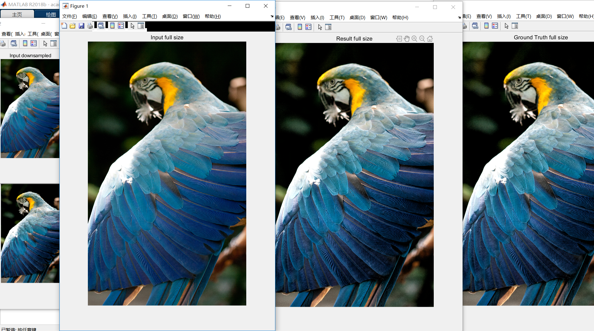

<!-- page_number: true -->

# Motivation
## How to look at the problem
- Illumination 
- Noise
- Reconstruction
- Smoothness
- Color
## How to work
Priori $\rightarrow$ Mathematics $\rightarrow$ Learning

---
# Octave Convolution

  

---
# Result

  

---
# Method

  

---
# Method
#### Vanilla Convolution
$$
Y_{p,q} = \sum {W_{i+k, j+k}}^T X_{p+i, q+i}
$$

#### Octave Convolution

$$
\begin{array}{lcl}
Y^H &=& f(X^H;W^{H \rightarrow H}) + upsample(f(X^L;W^{L \rightarrow H}),2) \\
Y^L &=& f(X^L;W^{L \rightarrow L}) + f(pool(X^H,2);W^{H \rightarrow L})
\end{array}
$$
- $f(X;W)$: *a convolution with parameters $W$*
- $pool(X,k)$: *an average pooling operation with kernel size $k\times k$ and stride $k$*
- $upsample(X, k)$: *an upsampling operation by a factor of $k$ via nearest interpolation*

---
# Relative Theoretical Gains
#### Memory cost (relative): $1 - \frac{3}{4} \alpha$
#### Computational cost (relative FLOPS): $1 - \frac{3}{4}\alpha(2-\alpha))$
$$
\begin{array}{lcl}
FLOPS(Y^{H \rightarrow H}) &=& h \times w \times k^2 \times (1 - \alpha)^2 \times c^2 \\
FLOPS(Y^{H \rightarrow L}) &=& \frac{h}{2} \times \frac{w}{2} \times k^2 \times \alpha \times (1 - \alpha) \times c^2 \\
FLOPS(Y^{L \rightarrow H}) &=& \frac{h}{2} \times \frac{w}{2} \times k^2 \times (1 - \alpha) \times \alpha \times c^2 \\
FLOPS(Y^{L \rightarrow L}) &=& \frac{h}{2} \times \frac{w}{2} \times k^2 \times \alpha^2 \times c^2
\end{array}
$$

  

---
# Bilateral Grid Related
- [Bilateral filter](https://en.wikipedia.org/wiki/Bilateral_filter)
- [A Fast Approximation of the Bilateral Filter using a Signal Processing Approach](https://dspace.mit.edu/bitstream/handle/1721.1/34876/MIT-CSAIL-TR-2006-073.pdf)
- [Real-time Edge-Aware Image Processing with the Bilateral Grid](https://people.csail.mit.edu/sparis/publi/2007/siggraph/Chen_07_Bilateral_Grid.pdf)
- [Bilateral Guided Upsampling](https://people.csail.mit.edu/hasinoff/pubs/ChenEtAl16-bgu.pdf)
- [Deep Bilateral Learning for Real-Time Image Enhancement](https://groups.csail.mit.edu/graphics/hdrnet/data/hdrnet.pdf)
- [Underexposed Photo Enhancement using Deep Illumination Estimation](http://jiaya.me/papers/photoenhance_cvpr19.pdf)

---
# Bilateral Grid
- Grid Creation
- Filtering
- Slicing

  

---
# Bilateral Guided Upsampling
Example: local Laplacian filters

  

---
# Bilateral Guided Upsampling 
image processing operator
- Downsample
- Local Affine
- Optimization (coefficient)
- Upsample

  

---
# Bilateral Guided Upsampling
Guided Filter 

  

---
# Bilateral Guided Upsampling
demo

  

---
# Bilateral Learning (HDRNet)

  

---
# Deep Illumination Estimation

  

