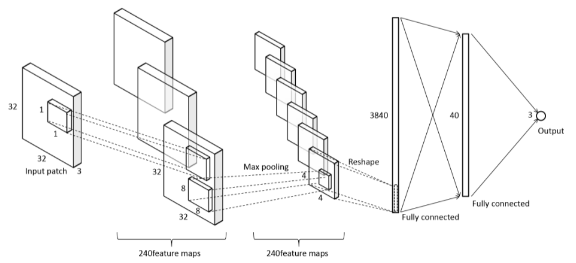
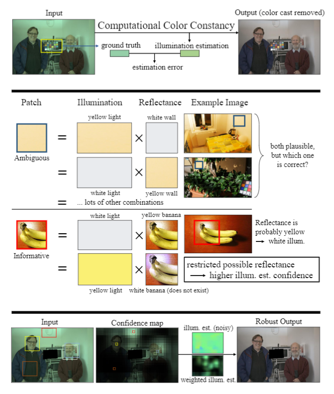
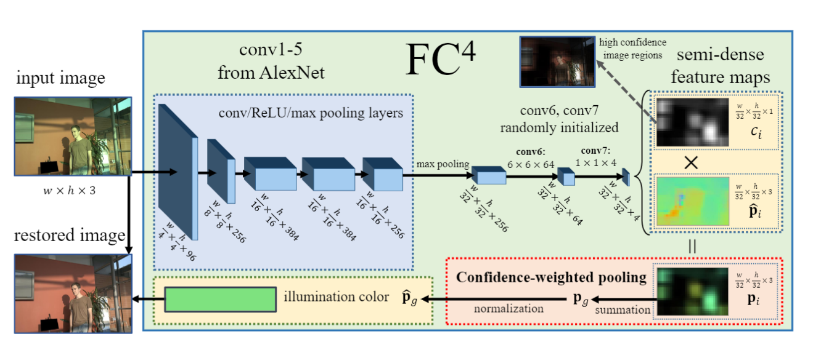
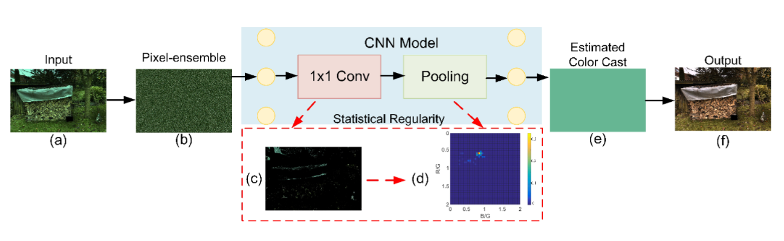

<!-- page_number: true -->

# Color Constancy
- [Color Constancy Using CNNs](https://arxiv.org/abs/1504.04548)  *2015 CVPR*
- [FC$^4$: Fully Convolutional Color Constancy with Confidence-weighted Pooling](https://github.com/yuanming-hu/fc4) *2017 CVPR*
- [Fully Point-wise Convolutional Neural Network for Modeling Statistical Regularities in Natural Images](https://arxiv.org/abs/1801.06302)

---
# CNN Color Constancy

	

---
# Confidence-weighted

	

---
# Confidence-weighted

	

---
# Modeling Statistical Regularities
## shuffle
local patch $\rightarrow$ global statistical regularities

	

---
# Dynamic Kernels in Color Constancy
- Why dynamic kernels
- Why non-local
- How to work
- Implement details

---
# Why dynamic kernels
## attention
confidence weight: *each pixel in each channel*
~~deformable convolution~~

---
# Why non-local
## global statistical features
~~deep multichannel confidence-weight net~~

---
# How to work
## *attention* + *non-local* = **representational ability**
- Input $\rightarrow$ color feature map
- color feature map $\rightarrow$ guidance confidence-weight
- guidance map $\rightarrow$ dynamic kernels 

---
# Implement details
## representational ability
- ### local spatial smoothness
  signal confidence (denoise)
- ### non-local
  $$y_i = \frac{1}{C(x)}\sum_j{f(x_i, x_j)*g(x_j)}$$
  signal representation (weight)

