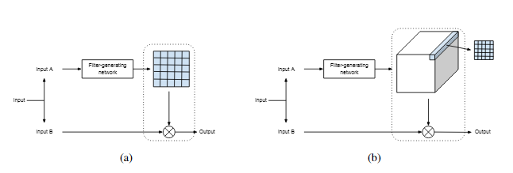
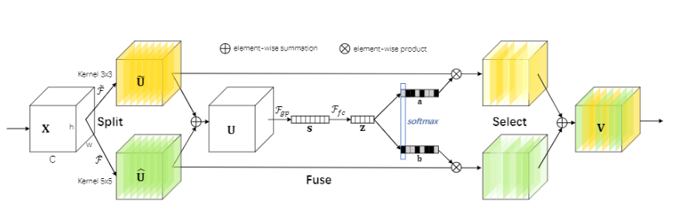
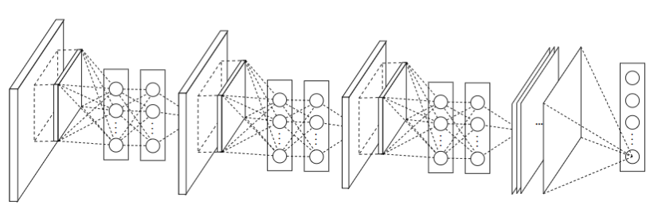
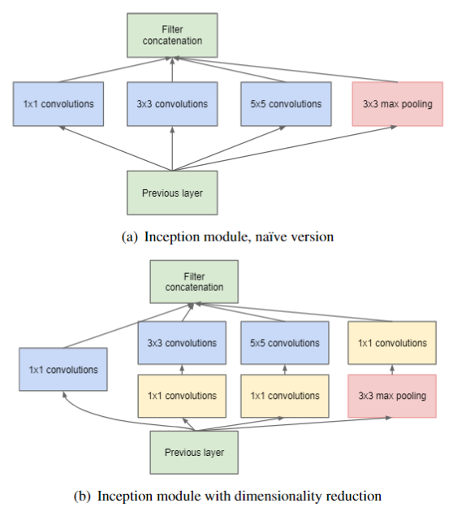
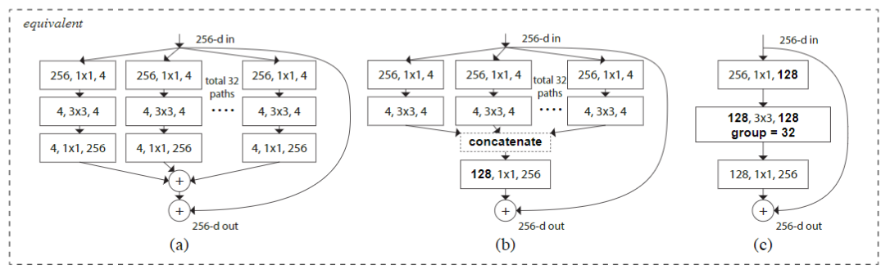
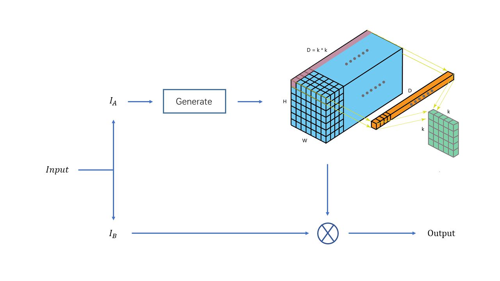

<!-- page_number : true -->

# Dynamic Convolution Implementation

- [Dynamic Filter Networks](https://arxiv.org/abs/1605.09673)
- [Selective Kernel Networks](https://arxiv.org/abs/1903.06586)

---
# Dynamic Kernels in Color Constancy
- Why dynamic kernels
  - adaptive attention
  - confidence weight of each patch in each channel 
- Why non-local
  - respective fields
  - global statistical regularities
- **Implementation**
  - Representational ability

---
# Dynamic Filter

  

$$G(i, j) = \mathcal F_\theta^{(i, j)}(I_B(i, j))$$

---
# Selective Kernel Networks

  

$$\mathbf z = \mathcal F_{fc}(\mathbf s) = \delta(\mathcal B(\mathbf Ws))$$

$$a_c = \frac{e^{\mathbf{A_c z}}}{e^{\mathbf{A_c z}} + e^{\mathbf{B_c z}}}, b_c = \frac{e^{\mathbf{B_c z}}}{e^{\mathbf{A_c z}} + e^{\mathbf{B_c z}}}$$

---
# Related Works

---
# Network In Network

  

- MLP (~~GLM~~)
  - Abstraction Capability
- GAP (~~Fully Connected~~)
  - Prevent Overfitting

---
# Inception

  

- GoogleNet (Naive & V1)
- Inception-V2
- Inception-V3
- Inception-V4

---
# ResNeXt

  

- ResNet + Inception
- Multi-branch
- Homogeneous

---
# Network Architecture

---

  
  

---
# Implementation Details
## Dynamic Scaling
- Local Similarity
- Dilated Convolution
## Guidance Map
- Non-local
- Kernels: patch consistency 
