<!-- page_number: true -->
# My Attempt
## Adaptive Median Filter + Histogram Equalization

  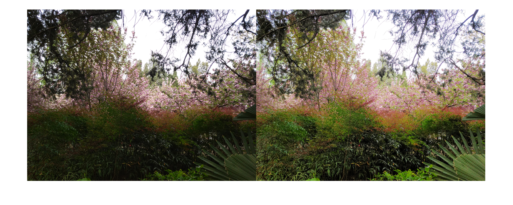
  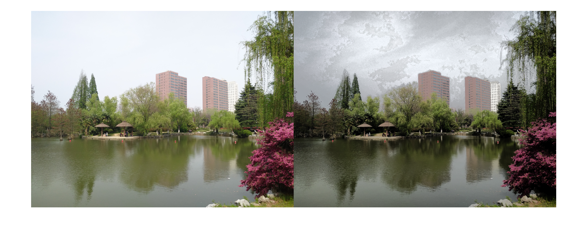
  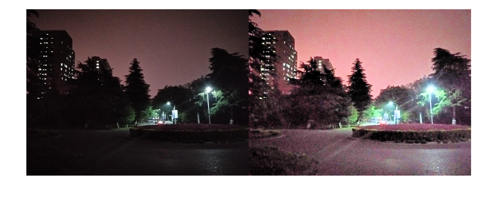
  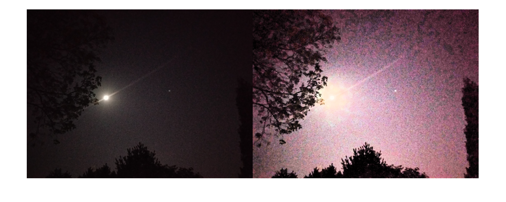

---
# My Attempt
## Training of *Learning to see in the dark*

  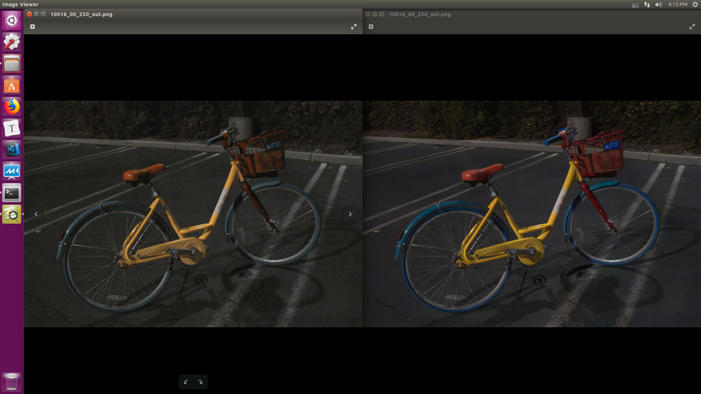
  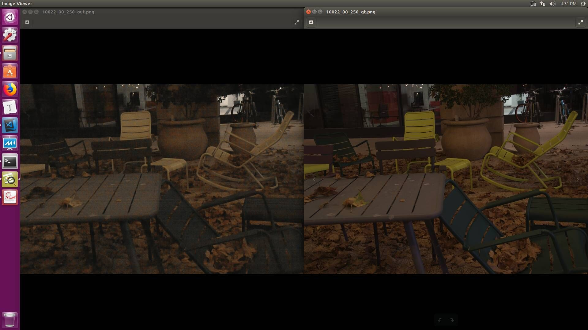

---
# Previous Challenge
## Amplification (low SNR)
- Noise Estimation
[Toward Convolutional Blind Denoisingof Real Photographs](https://github.com/GuoShi28/CBDNet)
- Illumination Estimation
[Underexposed Photo Enhancement using Deep Illumination Estimation](http://zhangqing-home.net/files/papers/2019/cvpr2019.pdf)
## Computing
- Memory & Speed
[Drop an Octave: Reducing Spatial Redundancy inConvolutional Neural Networks with Octave Convolution](https://arxiv.org/abs/1904.05049v1)

--- 

# 1. Blind Denoising 
## Noise Estimation
$$
\hat \sigma(\mathbf y) = \mathcal F_E(\mathbf y; \mathbf W_E)
$$
## Non-blind Denoising
$$
\hat {\mathbf x} = \mathcal F_D(\mathbf y, \hat \sigma(\mathbf y); \mathbf W_D)
$$

  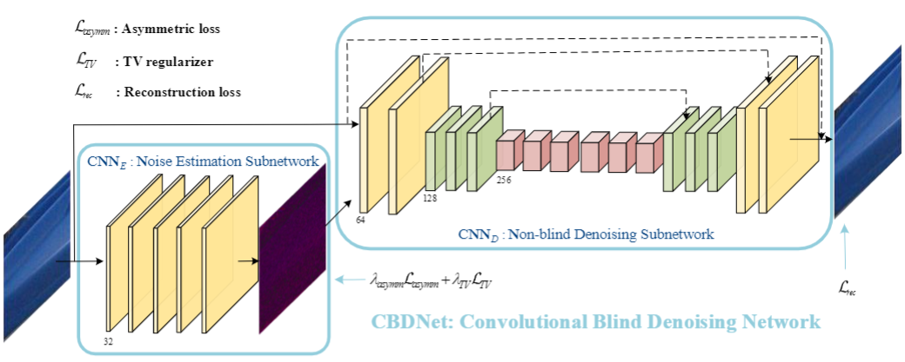

---
# Asymmetric Learning
$$
\begin{array}{lcl}
\mathcal L_{asymm} &=& \sum |\alpha - I_{\hat \sigma (y_i)-\sigma(y_i)}| \cdot (\hat \sigma (y_i)-\sigma(y_i))^2 \\
\mathcal L_{TV} &=& \| \nabla_h \hat \sigma(\mathbf y) \|_2^2 + \| \nabla_v \hat \sigma(\mathbf y) \|_2^2 \\
\mathcal L_{rec} &=& \| \hat \mathbf x -\mathbf x \|_2^2 \\
\mathcal L &=& \mathcal L_{rec} + \lambda_{asymm} \mathcal L_{asymm} +  \lambda_{TV} \mathcal L_{TV}
\end{array}
$$
> $I_e$ = ($e$ < 0 ? 1 : 0) ; 0 < $\alpha$ < 0.5

  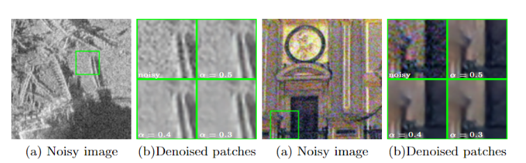

---
# 2. Illumination Estimation

  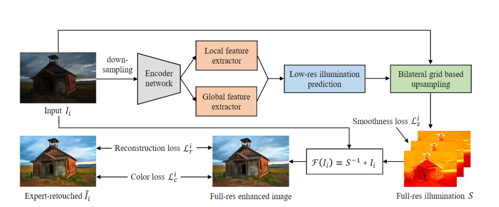

---
# Experiment

  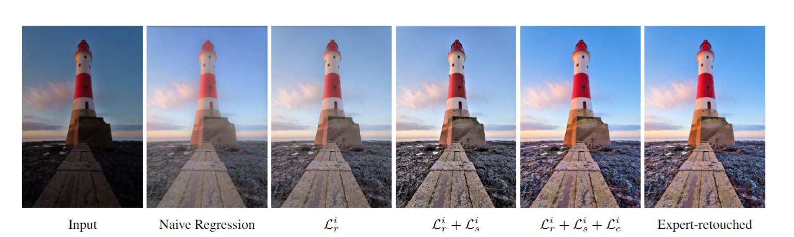
  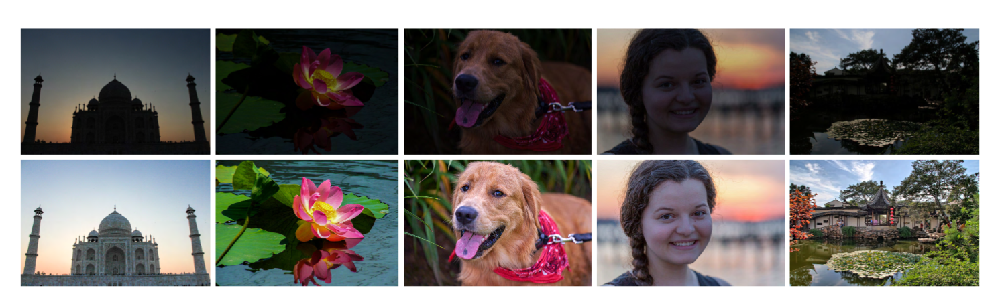

---
# Bilateral Grid

  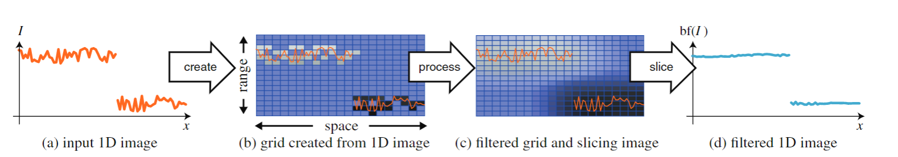
  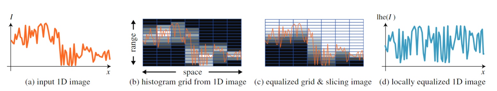

---
# 3. OctConv

  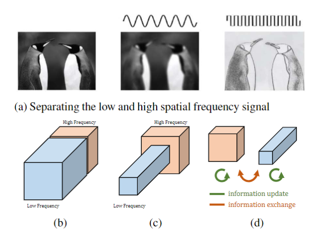

---
# Related Work
##### AlexNet & VGG
##### ResNet & DenseNet
##### ResNeXt & ShuffleNet
##### Xception & MobileNet
##### NAS, PNAS & AmoebaNet
##### DSD
##### ThiNet

---
# Method

  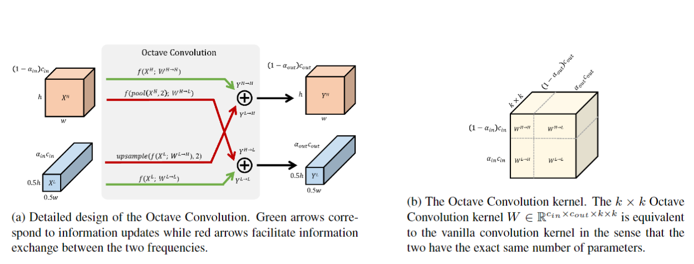

---
# Method
#### Vanilla Convolution
$$
Y_{p,q} = \sum {W_{i+k, j+k}}^T X_{p+i, q+i}
$$

#### Octave Convolution
$$
\begin{array}{lcl}
Y_{p, q}^H &=& Y_{p, q}^{H \rightarrow H} + Y_{p, q}^{L \rightarrow H} \\
&=& \sum {W_{i+k, j+k}^{H \rightarrow H}}^T X_{p+i, q+i}^H + \sum {W_{i+k, j+k}^{L \rightarrow H}}^TX_{\lfloor \frac{p}{2} \rfloor + i, \lfloor \frac{q}{2} \rfloor + i}^L \\

\end{array}
$$

$$
\begin{array}{lcl}
Y_{p, q}^L &=& Y_{p, q}^{L \rightarrow L} + Y_{p, q}^{H \rightarrow L} \\
&=& \sum {W_{i+k, j+k}^{L \rightarrow L}}^T X_{p+i, q+i}^L + \sum {W_{i+k, j+k}^{H \rightarrow L}}^TX_{2p+\frac{1}{2}+i, 2q+\frac{1}{2}+i}^H \\

\end{array}
$$

---
# Method
$$
\begin{array}{lcl}
Y^H &=& f(X^H;W^{H \rightarrow H}) + upsample(f(X^L;W^{L \rightarrow H}),2) \\
Y^L &=& f(X^L;W^{L \rightarrow L}) + f(pool(X^H,2);W^{H \rightarrow L})
\end{array}
$$
- $f(X;W)$: *a convolution with parameters $W$*
- $pool(X,k)$: *an average pooling operation with kernel size $k\times k$ and stride $k$*
- $upsample(X, k)$: *an upsampling operation by a factor of $k$ via nearest interpolation*

---
# Relative Theoretical Gains
#### Memory cost (relative): $1 - \frac{3}{4} \alpha$
#### Computational cost (relative FLOPS): $1 - \frac{3}{4}\alpha(2-\alpha))$
$$
\begin{array}{lcl}
FLOPS(Y^{H \rightarrow H}) &=& h \times w \times k^2 \times (1 - \alpha)^2 \times c^2 \\
FLOPS(Y^{H \rightarrow L}) &=& \frac{h}{2} \times \frac{w}{2} \times k^2 \times \alpha \times (1 - \alpha) \times c^2 \\
FLOPS(Y^{L \rightarrow H}) &=& \frac{h}{2} \times \frac{w}{2} \times k^2 \times (1 - \alpha) \times \alpha \times c^2 \\
FLOPS(Y^{L \rightarrow L}) &=& \frac{h}{2} \times \frac{w}{2} \times k^2 \times \alpha^2 \times c^2
\end{array}
$$

  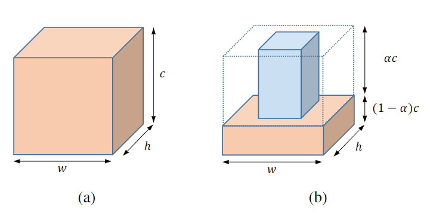

---
# Result

  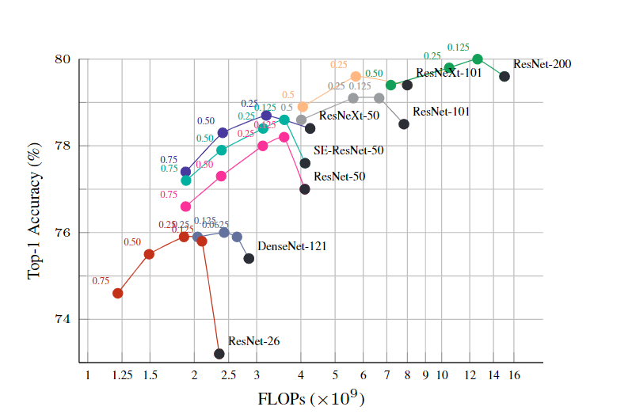

