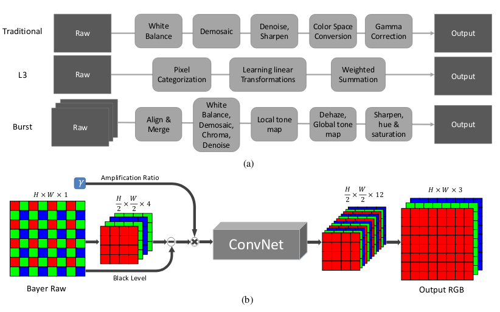

# Learning to See in the Dark

#### CVPR 2018

 

> ###### by [Chen Chen](http://cchen156.web.engr.illinois.edu/), [Qifeng Chen](http://cqf.io/), [Jia Xu](http://pages.cs.wisc.edu/~jiaxu/), and [Vladlen Koltun](http://vladlen.info/). 
> view: [GitHub](https://github.com/cchen156/Learning-to-See-in-the-Dark), [Video](https://youtu.be/qWKUFK7MWvg)

---
<!-- page_number: true -->
# Introduction

#### challenge
- extreme low-light
- short exposure
- low SNR

---
$$I_{mage} = f(I \times R + N \ ; \ s) $$

> $I$ : illumination $\Leftarrow$ light scence
> $R$ : reflection $\Leftarrow$ object properties
> $s$ : paramaters $\Leftarrow$ ISO, exposure
> $N$ : noise $\Leftarrow$ $\alpha P_i + N_i$ 
> - $P_i \sim P(x)$
> - $N_i \sim N(0,\sigma^2)$

---
# Related Work

#### Image denoising
- total variation
- wavelet-domain 
- sparse coding
- nuclear norm minimization
- BM3D
> #### shortcuts
> - based on specific image priors
> - evaluated on synthetic data 

---
# Related Work

#### Low-light image enhancement
- histogram equalization
- gamma correction
- global analysis and processing
> #### shortcuts
> - do not explicitly model image noise
> -  typically apply off-the-shelf denoising as a postprocess

---
# Method

---

